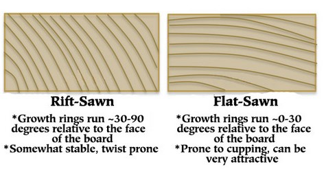

# Description 
This project is desgined to help furniture makers caculate wood movement. This will allow them to correctly design furniture to allow for the seasonal wood movement. I designed this web app with the thought that it will be mainly used on someones phone while they are in their workshop to do a quick caculation.
For people who do not know as much about wood working, the normal humidity range would be anywhere between 0% and 30%. Flat sawn and rift sawn are different grain orientation which effect the amount of wood movement. Flat sawn is what you normally see at the hardwear store. Rift sawn is a speciality cut where the grain is perpendicular to the bottom of the board (picture below). This information combined with the board width and the species allows you to caculate how much a piece of wood will move.

# Motivation
My husband is a furniture maker and having a tool like this would be really benfical for him and others in the same proffesion. 

# Built With
HTML, CSS and JavaScript.

# Demo Site
https://isabelmcilroy.github.io/woodMovementCaculator/

